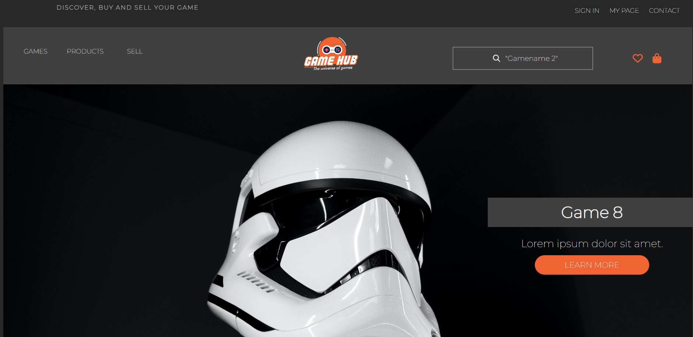

# Cross Course Project 1



## Description

The brief in this cross course project was to create a properly functioning, responsive website for the assignment brief we had chose in Design 1 process. I chose to create a game site called GameHub. GameHub is an online shop where users can purchase computer games. This gaming marketplace lets you buy tons of video games online for any device. 

The target group for this site is gamers, aged 18 to 25 who are interested in computer games, and would either like to purchase games or would like to sell games they have finished playing.

The blog consists of 7 pages:

- Home
- List of games
- A games page showing the product details (product details such as the description of the product, price and add to cart button)
- Checkout page
- Checkout success
- About
- Contact

## Built With

This site was built with

- HTML
- CSS
- JavaScript

## Getting Started

The project does not contain any dependencies, and can easily be installed/run by cloning the GitHub repo.


```bash
git clone https://github.com/Ingvildb1/gamehub1.git
```


## Contributing

I am a newbie to front-end development, and I am very sure there are many improvements to be made. If you wish to contribute by sending in feedback, you are welcome to do so.

## Contact


[My LinkedIn page](www.linkedin.com/in/ingvild-berger-7268771b3)
